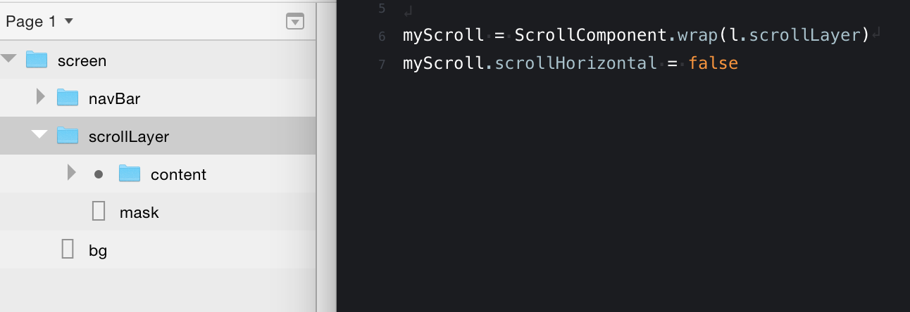

# Framer JS Examples and Snippets

*Organizing my Framer Studio examples and snippets.*

## Global Layers

Remove the need to preceded the layer name with the file name when importing Sketch of Photoshop files by adding 'Utils.globalLayers(mySketchFile)' below the importer line. For example:

```coffee
# Import file "mySketchFile"
mySketchFile = Framer.Importer.load("imported/grid-images@1x")

Utils.globalLayers(mySketchFile)
```


## Backgrounds

### Solid

```coffee
bg = new BackgroundLayer backgroundColor: "#eaeaea"
```

### Gradient

```coffee
bg = new BackgroundLayer
bg.style.background = "-webkit-linear-gradient(top, #FFFFFF 0%, #E0E3E8 100%)"
```

### Canvas Background

```coffee
Canvas.backgroundColor = "B3E3FF"
```


## Lighten

How to use .lighten and .darken:

```coffee
keyColor = new Color("#1d61f0")

layers = []
for i in [0..3]
	layer = new Layer
		width: 250, height: 250
		x: 250 * i
		backgroundColor: keyColor.lighten(i * 10)
```


## Scrolling

```coffee
# Create a scroll component
scroller = new ScrollComponent
     width: Screen.width, height: Screen.height
scroller.scrollHorizontal = false

# Create and add a layer to a scroll component
longLayer = new Layer
	width: Screen.width, height: Screen.height * 3
	superLayer: scroller.content
```

```coffee
# listen for scroll; print Y position (test)
scroller.onScroll ->
    print scroller.scrollY

# Prevent dragging beyond top
# listen for layer moving and prevent pulling down
scroller.onMove ->
	if scroller.scrollY <= 0 then scroller.scrollY = 0
```

```coffee
# mask a wrapped layer group in a scroll component
scroll = ScrollComponent.wrap sketch.group

# constrain scrolling
scroll.scrollHorizontal = false

# set padding
scroll.contentInset =
    bottom: 90
```

### How to Scroll with Sketch (or Photoshop)




## Paging

```coffee
pager = new PageComponent
	scrollVertical: false

pager.addPage listView
pager.addPage detailView

pager.snapToPage listView, false # false makes it instant
```


## Functions

```coffee
fade = (layer) ->
	layer.animate
		properties:
			opacity: 0
		time: 0.3

fade(layerA)
```


## Arrays and Objects

```coffee
# Arrays
colors = ["#f1c40f", "#2ecc71", "#1abc9c", "#3498db", "#9b59b6"]
# Accessing an array
bg = new BackgroundLayer
	backgroundColor: colors[0]

# Array of Objects
arrayOfObjects = [
	{name: "Steve", favoriteColor: "blue"}
	{name: "Maggie", favoriteColor: "red"}
	{name: "Ryan", favoriteColor: "green"}
]
# Accessing the array of objects
print arrayOfObjects[0].name
print arrayOfObjects[0].favoriteColor
```

### Push layers to an array

```coffee
layerArr = []
for i in [0..3]
    layer = new Layer
        name: "layer_" + i
    layerArr.push(layer)
print layerArr
```

### Assign a name based on the index number

```coffee
for i in [0..4]
	layer = new Layer
		name: "layer_" + i
		y: 172 * i
		x: 0
		width: Screen.width
		height: 150
	print layer.name

	layer.onClick ->
		if @.name == "layer_0"
			print "layer 0 tapped"
		else if @.name == "layer_1"
			print "layer 1 tapped"
		else if @.name == "layer_2"
			print "layer 2 tapped"
		else if @.name == "layer_3"
			print "layer 3 tapped"
		else if @.name == "layer_4"
			print "layer 4 tapped"
```


## Text

```coffee
# Adding a label to a layer and styling text
navBar = new Layer
	width: Screen.width
	height: 128
	backgroundColor: "rgba(21,21,23,1)"
	html: "My Label"
	style:
		"font-family": "-apple-system"
		"font-size": "34px"
		"color": "#ffffff"
		"font-weight": "500"
		"line-height": "148px"
		"text-align": "center"
```


## Animation

### Spring Curve

Tension – how tight the spring is coiled
Friction – how much effort it takes to move the object
Velocity - the initial speed that launches the object

```coffee
spring(400, 40, 0)
```

### Alternate between two animations

```coffee
animationA.on(Events.AnimationEnd, animationB.start)
animationB.on(Events.AnimationEnd, animationA.start)

animationA.start()
```

### Create reverse of animation

```coffee
animationB = animationA.reverse()
```

### Loop.delta

`Framer.Loop.delta = 1 / 1000`

Slows down animations to make fine tuning easier. Adjust the last number (1000) to control amount. For example:

```coffee
layerA = new Layer
layerA.animate
	properties: { x: 400, y: 400 }
	curve: "spring(600, 40, 0)"

# Slow down animations
Framer.Loop.delta = 1 / 1000
```


## Utils.Modulate
```coffee
# input value, input range, output range, true (limits output to values set in output)
Utils.modulate(value, [0, 1], [0, 100], true) # input value, input range, output range

# example usage
layerA.y = Utils.modulate this.y, [0, 1], [0, 2]
```


## Math.abs

Returns the absolute value of a number. This is useful when you don't care if the number is positive or negative. For example, in a scrolling layer you might want to know if a layer has moved by a certain threshold irregardless of positive or negative. It's easier and more streamlined to subtract numbers when you're not dealing with negatives.

```coffee
dragLayerEnd = Math.abs(dragLayer.y)
amountMoved = dragLayerStart - dragLayerEnd
```


## Preferences

Notes from [Managing Styles and CSS in Framer](http://martenbjork.com/2016/05/managing-styles-and-css-in-framer/) by Marten Bjork. Excellent article!

```coffee
# Add a default to all layers (not recommended)
Framer.Defaults.Layer.backgroundColor = "#ffcd02"

# Create preferences
prefs = {}
prefs.margin = 20
prefs.borderRadius = 12
# Create a styles preference
prefs.styles = {}
# One for bodyText
prefs.styles.bodyText =
	fontFamily: 'Avenir'
	fontWeight: 500
	fontSize: '72px'
	textAlign: 'center'
	lineHeight: '300px'

# Use preferences on a layer
layerA = new Layer
	x: prefs.margin
	y: prefs.margin
	size: 300
	borderRadius: prefs.borderRadius
	html: "My layer"
	style: prefs.styles.bodyText
```

[View an example file](http://share.framerjs.com/36d3yp71dudn/) – Click link and then click open to download and see code above in action.

